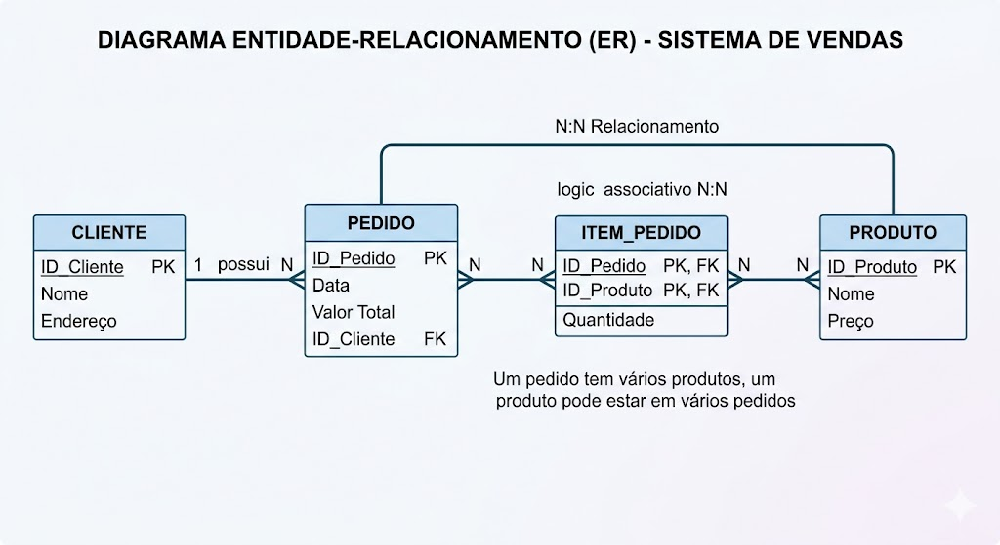

## Banco de Dados

### Embora o repositório seja focado em java, também irei estudar/abordar conceitos de banco de dados...

### SQL 
**SQL (Structured Query Language)** é a linguagem padrão para gerenciar e manipular bancos de dados relacionais. Ela permite `criar` tabelas, `consultar`, `inserir`, `atualizar` e `excluir` dados usando comandos simples baseados em inglês, sendo essencial para analistas e desenvolvedores. Exemplos comuns incluem `SELECT`, `INSERT`, `UPDATE` e `DELETE`.

**Conceitos Básicos de SQL**
* **Banco de Dados Relacional:** Conjunto de dados organizados em tabelas relacionadas entre si.
* **Tabela:** Estrutura básica, semelhante a uma planilha, com colunas e linhas.
* **Coluna (`Atributo`):** Define o tipo de dado (ex: nome, idade, e-mail).
* **Linha (`Registro`):** Uma entrada específica na tabela.
* **Chave Primária (`Primary Key`):** Identificador único de cada linha em uma tabela (ex: ID).
* **Chave Estrangeira (`Foreign Key`):** Campo que relaciona uma tabela a outra. 

**Principais Categorias de Comandos**
* **DML (Data Manipulation Language):** Manipula dados (`SELECT`, `INSERT`, `UPDATE`, `DELETE`).
* **DDL (Data Definition Language):** Define a estrutura (`CREATE`, `ALTER`, `DROP`).

**Exemplos Práticos de SQL**

* Selecionar todos os dados de uma tabela (`SELECT`):
``` 
    SELECT * FROM clientes;
```

* Selecionar colunas específicas e ordenar (`SELECT`, `ORDER BY`):
```
    SELECT nome, email FROM clientes ORDER BY nome ASC;
```

* Inserir novos dados (`INSERT`):
```
    INSERT INTO clientes (nome, email) VALUES ('João Silva', 'joao@email.com');
```

* Atualizar Dados (`UPDATE`):
```
    UPDATE clientes SET email = 'novo_email@email.com' WHERE id = 1;
```

* Excluir Dados (`Delete`):
```
    DELETE FROM clientes WHERE id = 1;
```
---

### MER e DER
`MER` (Modelo Entidade-Relacionamento) e `DER` (Diagrama Entidade-Relacionamento) são ferramentas cruciais de modelagem de dados. O MER é o modelo conceitual (teórico) que define entidades, atributos e relacionamentos. O DER é a representação gráfica (visual) desse modelo, materializando o projeto com chaves primárias e estrangeiras para implementação do banco. 

**Diferenças Principais (MER vs DER):**
* **MER (Modelo):** É abstrato, focado em regras de negócio e planejamento textual, focado na estrutura.
* **DER (Diagrama):** É o desenho visual, utilizando símbolos (retângulos, losangos) para representar tabelas e conexões.
* **Foco:** O **MER** define o que armazenar; o **DER** define como estruturar visualmente.

**O que compõe o MER e DER**
* **Entidade:** Objeto do mundo real (ex: `Cliente`, `Produto`).
* **Atributo:** Propriedade da entidade (ex: `CPF`, `Nome`).
* **Relacionamento:** Conexão entre entidades (ex: `Cliente compra Produto`).
* **Cardinalidade:** Quantidade de relacionamentos (ex: `1:1`, `1:N`, `N:N`).

**Exemplo Prático: Sistema de Vendas**
* **Entidades:** `CLIENTE`, `PEDIDO`, `PRODUTO`.
* **Atributos:**

    * **CLIENTE:** ID_Cliente (Chave Primária), Nome, Endereço.
    * **PEDIDO:** ID_Pedido, Data, Valor Total.
    * **PRODUTO:** ID_Produto, Nome, Preço.

* **Relacionamentos e Cardinalidade:**

  > CLIENTE --(1:N)-- PEDIDO (Um cliente pode fazer vários pedidos, um pedido pertence a um cliente).
  PEDIDO --(N:N)-- PRODUTO (Um pedido tem vários produtos, um produto pode estar em vários pedidos).

<div align="center">
  
</div>

### Tabelas, colunas e Registros

Tabelas em bancos de dados relacionais funcionam como planilhas, organizando dados em colunas (campos/atributos que definem o tipo de informação, como Nome ou Preço) e registros (linhas/entradas únicas de dados, como um cliente específico). Eles estruturam informações em um formato tabular rígido (SQL).

**Componentes de um Banco de Dados**
* **Tabela (`Table`):** Estrutura fundamental que organiza dados sobre um tema específico (ex: `Clientes`, `Produtos`).
* **Coluna (`Campo/Attribute`):** Define o tipo de dado armazenado (ex: `ID`, `Nome`, `Data_Nascimento`). Cada coluna tem um tipo (`texto`, `número`, `data`).
* **Registro (`Linha/Registro`):** Uma entrada individual e única na tabela (ex: os dados de um cliente específico como "João", "25 anos", "Rua A").
* **Chave Primária (`Primary Key`):** Um identificador único para cada registro, garantindo que não haja duas linhas idênticas.

<table>
  <thead>
    <tr>
      <th>ID (PK)</th>
      <th>Nome</th>
      <th>Email</th>
      <th>Telefone</th>
      <th>Data_Cadastro</th>
    </tr>
  </thead>
  <tbody>
    <tr>
      <td>1</td>
      <td>Ana Silva</td>
      <td>ana@email.com</td>
      <td>9999-0001</td>
      <td>2023-01-15</td>
    </tr>
    <tr>
      <td>2</td>
      <td>Bruno Souza</td>
      <td>bruno@email.com</td>
      <td>9999-0002</td>
      <td>2023-02-10</td>
    </tr>
    <tr>
      <td>3</td>
      <td>Carla Dias</td>
      <td>carla@email.com</td>
      <td>9999-0003</td>
      <td>2023-03-05</td>
    </tr>
  </tbody>
</table>

* **Tabela:** Clientes
* **Colunas:** ID, Nome, Email, Telefone, Data_Cadastro.
* **Registro:** A linha 2 | Bruno Souza | bruno@email.com | 9999-0002 | 2023-02-10.

**Exemplo em SQL:**
```
    -- Criando uma tabela
    CREATE TABLE Clientes (
        ID INT PRIMARY KEY,
        Nome VARCHAR(100),
        Email VARCHAR(100),
        Data_Cadastro DATE
    );
    
    -- Inserindo um registro
    INSERT INTO Clientes (ID, Nome, Email, Data_Cadastro)
    VALUES (1, 'Ana Silva', 'ana@email.com', '2023-01-15');
```

### JOINs
Consultas com junções (JOINs) e subconsultas em SQL são ferramentas essenciais para combinar e filtrar dados de múltiplas tabelas. JOIN conecta tabelas por colunas relacionadas (INNER, LEFT), sendo geralmente mais eficiente. Subconsultas são consultas aninhadas que isolam lógica complexa, usadas frequentemente no WHERE ou FROM para cálculos específicos.

**Junções (JOINs) **
A `INNER JOIN` combina registros de duas tabelas (ex: Clientes e Pedidos) que possuem valores correspondentes em ambas.

```
    SELECT Pedidos.ID, Clientes.Nome, Pedidos.DataPedido
    FROM Pedidos
    INNER JOIN Clientes ON Pedidos.ClienteID = Clientes.ID;
```

**Subconsultas (Subqueries)**
Uma subconsulta pode ser usada para filtrar dados baseados no resultado de outra tabela (ex: produtos com preço acima da média).

```
    SELECT Nome, Preco
    FROM Produtos
    WHERE Preco > (SELECT AVG(Preco) FROM Produtos);
```

**Principais Diferenças e Casos de Uso:**
* **JOINs:** Melhor para listar dados de tabelas relacionadas e quando há grande volume de dados.
* **Subconsultas:** Ideal para filtrar (usando IN, EXISTS) ou quando se precisa de um valor único de outra tabela (escalar).
* **Dica:** Utilize explicacao SQL para treinar. Subconsultas no FROM (também conhecidas como tabelas derivadas) podem aumentar a legibilidade.

**Exemplo Combinado (Complexo):**
Selecionar clientes que fizeram pedidos acima da média total.

```
    SELECT Nome
    FROM Clientes
    WHERE ID IN (
        SELECT ClienteID 
        FROM Pedidos 
        WHERE Total > (SELECT AVG(Total) FROM Pedidos)
    );
```

